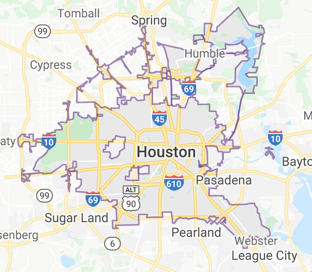

```{r setup, include=FALSE}
library(dbplyr)
library(dplyr)
library(knitr)
library(kableExtra)
library(ggplot2)
library(ggmap)
data(crime)
```

# Houston Crime Dataset

```{r comment=NA}
writeLines(names(crime))
```

Given our dataset with the above attributes, we will asses certain patterns & information about the crimes reported in Houston, TX.

# Questions:
                    
            1. The distribution of crimes & patterns throughout a day
            
            2. The distribution of crimes & patterns throughout a week
            
            3. The distribution of crimes & patterns throughout a month
            
            4. Distribution of offenses in relation to street
            
            5. Crime densities by street
            
```{r comment=NA}
crime_by_hour<-crime%>%group_by(hour)%>%summarise(count=n())%>%mutate(prop=count/sum(count))

crime_by_week<-crime%>%group_by(day)%>%summarise(count=n())%>%mutate(prop=count/sum(count))

crime_by_month<-crime%>%group_by(month)%>%summarise(count=n())%>%mutate(prop=count/sum(count))

crime_by_offense<-crime%>%group_by(offense)%>%summarise(count=n())%>%mutate(prop=count/sum(count))

```


```{r}
ggplot(crime_by_offense, aes(x=offense,y=count,fill=offense)) +   geom_bar(stat="identity")+geom_text(aes(label=count), vjust=1.6, color="white", size=3.5)+theme_minimal()+ggtitle("Offense Distribution")

crime_by_offense%>%kable()
```

# Analysis:

 We cans see observe that crimes in the houston area are predominantly theft, accounting for more than 53% of total crimes, burglary 2nd at 20% both accounting for a total of 73% of crimes. Proportion of muder and rape account for 0.5%, while it it relatively low it is far from 0 accoutning for a total of 500 during 2010. We will later explore details of these specific crimes

```{r}
ggplot(data=crime_by_month, aes(x=month, y=count)) +
  geom_bar(stat="identity", fill="steelblue")+
  geom_text(aes(label=count), vjust=1.6, color="white", size=3.5)+
  theme_minimal()+ggtitle("Crime by Month Distribution")
```

# Analysis:

Rate of crimes stay relatively uniform throughout the year with a slighy dip in february and sligh upward trend in may, there will be further investigates of the offense distribution by month to see if they follow the same uniform distribution as well

```{r}
ggplot(data=crime_by_week, aes(x=day, y=count)) +
  geom_bar(stat="identity", fill="steelblue")+
  geom_text(aes(label=count), vjust=1.6, color="white", size=3.5)+
  theme_minimal()+ggtitle("Crime by Day Distribution")
```

# Analysis:

Rate of crimes stay relatively uniform throughout the week as well with a dip on Sunday( I guess even criminals need a day off), and a little up on Friday

```{r}
ggplot(crime_by_hour, aes(x=hour,y=count)) +  geom_density(stat="identity",color="darkblue", fill="lightblue",alpha=0.5)+theme_minimal()+ggtitle("Crime by Hour Distribution")

slice(crime_by_hour%>%arrange(desc(count)),1:10)%>%kable()
```

# Analysis:

Rate of crimes throughout the day show an interesting pattern, there is an upward trend from 5 AM all the way to 12 AM and a big spike down, with some peaks 


```{r  echo=FALSE,, out.width = '82.5%'}


ggplot(crime, aes(x = lon, y = lat)) + 
  coord_equal() + 
  xlab('Longitude') + 
  ylab('Latitude') + 
  stat_density2d(aes(fill = ..level..), alpha = .5,
                 h = .02, n = 300,
                 geom = "polygon", data = crime) + 
  scale_fill_viridis_c() + 
  theme(legend.position = 'none')+ggtitle("Crime Density by Location")
```


# Analysis:

We observe particular locations in the Houston Area with dense distribution of crimes